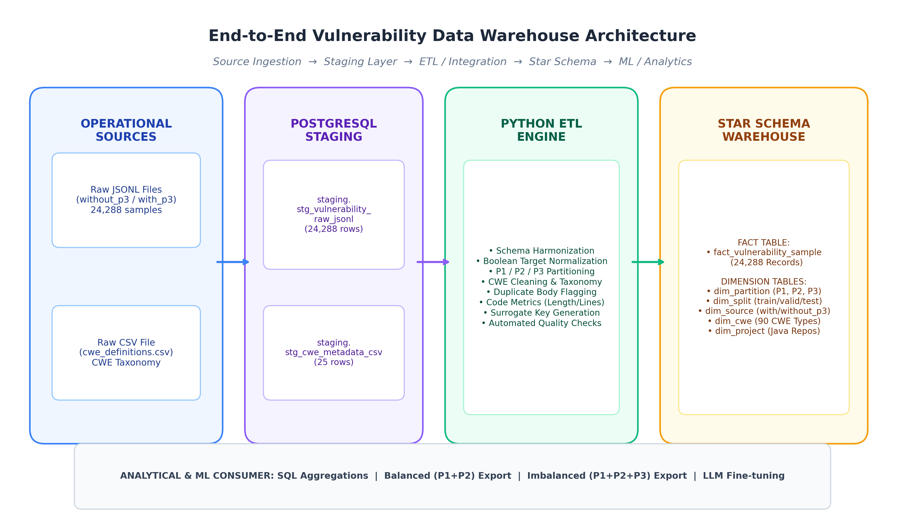
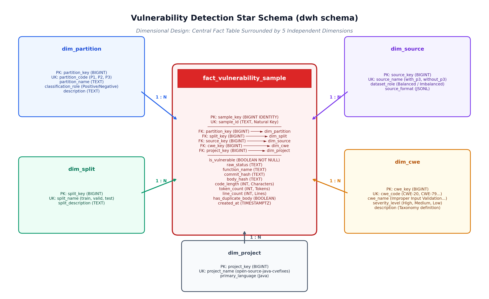

## 1. Objective and Learning Outcomes

### Purpose
To design, implement, and validate an enterprise-grade data warehouse and ETL pipeline in **PostgreSQL** that extracts heterogeneous, multi-format software security data, transforms it into a standardized dimensional Star Schema, enforces data quality constraints, and supports complex analytical queries required for vulnerability detection research using Large Language Models.

### Learning Outcomes Achieved
1. **Dimensional Modeling vs Operational Systems:** Contrasted raw operational commit/NVD dumps with an auditable analytical Star Schema separating facts and dimensions.
2. **Multi-Source ETL Pipeline:** Extracted and harmonized multi-format inputs (JSONL and CSV) into an isolated staging schema.
3. **Data Quality & Invariant Enforcement:** Designed transformation rules resolving missing CWEs, boolean target discrepancies, code length metrics, and deduplication flags.
4. **Surrogate Key Architecture:** Loaded dimensions first, generated surrogate identity keys, and enforced relational integrity on the central fact table.
5. **Analytical SQL:** Formulated aggregations, conditional filters, and window functions answering key empirical research questions.
6. **Research Interpretation:** Evaluated how data engineering decisions mitigate machine learning hazards such as data leakage, label poisoning, and class skew.

---

## 2. Short Article Analysis (Task 1)

### 100-Word Summary
> Shestov et al. (2025) investigate fine-tuning decoder-only Large Language Models (WizardCoder 13B) for binary vulnerability detection in Java functions compared to state-of-the-art encoder models (ContraBERT). The authors construct their benchmark by extracting single-function-change commits from CVEfixes, a manually curated dataset, and VCMatch. They isolate vulnerable functions ($P_1$), patched fixes ($P_2$), and neutral functions ($P_3$). WizardCoder outperforms ContraBERT across balanced ($1:1$) and realistic imbalanced ($1:34$) datasets. Using batch-packing sequence concatenation, training accelerated by over 13x, demonstrating that fine-tuned generative LLMs capture nuanced security vulnerabilities when class imbalance and training regimes are properly optimized.

### Analysis of Research Questions:
* **(a) Vulnerability-Detection Target:** Binary classification of individual Java functions/methods as either **Vulnerable** (`is_vulnerable = True`, class 1) or **Non-Vulnerable** (`is_vulnerable = False`, class 0).
* **(b) Source Datasets Used:**
  1. *CVEfixes:* Automatically mined vulnerabilities and patches from GitHub and NVD (large, but contains refactoring noise).
  2. *Manually-Curated Dataset (Ponta et al.):* 624 verified vulnerabilities across 205 open-source Java projects with expert-verified security commits.
  3. *VCMatch:* High-precision security patch localization dataset covering 10 prominent open-source repositories.
* **(c) Meaning of Vulnerable / Non-Vulnerable Labels:**
  * *Vulnerable (`1`):* The function's code state **before** the security patch commit was merged.
  * *Non-Vulnerable (`0`):* Either the patched version of the function **after** the commit, or clean unmodified functions residing in the patched repository files.
* **(d) The Role of P1, P2, and P3:**
  * **$P_1$ (Positive Class):** Vulnerable function pre-change code ($1,311$ samples).
  * **$P_2$ (Hard Negative Class):** Post-change fixed version of the same function ($1,316$ samples). It serves as a "hard negative" because it differs from $P_1$ by only a few patched lines, forcing the model to learn subtle semantic bug fixes rather than superficial syntactic cues.
  * **$P_3$ (Easy Negative Class):** Untouched, clean functions extracted from patched files ($21,661$ samples). These represent neutral ambient code.
* **(e) Why Class Imbalance is an Important Data Problem:**
  In real-world software, vulnerabilities occur in less than 2–3% of functions. Models trained solely on artificially balanced 1:1 datasets exhibit catastrophic false-positive rates when deployed to production. Evaluating models under a realistic 1:34 ratio ($X_1$ with $P_3$) is essential to evaluate true clinical utility.

---

## 3. Source Data Description (Task 3)

The pipeline integrates two distinct source data formats:

1. **JSONL Format (Paper Benchmark Datasets):**
   * Downloaded directly from the official repository: `https://github.com/rmusab/vul-llm-finetune/tree/main/Datasets`
   * Datasets:
     * `without_p3`: Balanced ablation variant containing $P_1$ and $P_2$ ($1,334$ samples: 810 train, 272 valid, 252 test).
     * `with_p3`: Imbalanced realistic variant containing $P_1$, $P_2$, and $P_3$ ($22,954$ samples: 13,247 train, 5,131 valid, 4,576 test).
   * Total raw samples ingested: **24,288 records**.
   * Attributes: `code`, `code_tokens`, `cwe`, `status`, `target`, `commit`, `function_name`, `body_hash`, `idx`.

2. **CSV Format (CWE Taxonomy and Vulnerability Metadata):**
   * File: `data/raw/cwe_definitions.csv`
   * Attributes: `cwe_code`, `cwe_name`, `severity_level`, `description`.
   * Maps Common Weakness Enumeration identifiers to standardized vulnerability names and criticality levels.

### Staging Layer Architecture
To maintain full data lineage and auditability, all raw records are loaded without modification into isolated tables in the `staging` schema:
* `staging.stg_vulnerability_raw_jsonl`
* `staging.stg_cwe_metadata_csv`

---

## 4. Data Warehouse Architecture & Star Schema (Task 2)

### Source-to-Target Architecture Flow



### Star Schema Entity-Relationship Model



### Dimensional Entity Descriptions
* **`dim_partition`:** Surrogate key `partition_key`, business code (`P1`, `P2`, `P3`), name, and classification role (`Positive Class`, `Hard Negative`, `Easy Negative`).
* **`dim_split`:** Surrogate key `split_key`, split name (`train`, `valid`, `test`), and description.
* **`dim_source`:** Surrogate key `source_key`, source dataset identifier (`with_p3`, `without_p3`), role, and format (`JSONL`).
* **`dim_cwe`:** Surrogate key `cwe_key`, standard code (`CWE-20`, `CWE-79`...), weakness name, severity (`High`, `Medium`, `Low`, `Unknown`), and taxonomy definition.
* **`dim_project`:** Surrogate key `project_key`, project/repository name, and language (`Java`).
* **`fact_vulnerability_sample`:** Central fact table with surrogate key `sample_key`, natural business key `sample_id`, 5 foreign keys referencing all dimensions, target flag `is_vulnerable`, function and commit identifiers, code hash `body_hash`, measures (`code_length`, `token_count`, `line_count`), duplicate body flag `has_duplicate_body`, and creation timestamp.

---

## 5. Transformation and Data Quality Rules (Tasks 4 & 6)

### Transformation Rules Implemented
1. **Column Normalization:** All attributes standardized into lowercased `snake_case`.
2. **Boolean Unification:** Harmonized conflicting upstream target flags (`target = 1`, `status = 'VULNERABLE'` $\rightarrow$ `is_vulnerable = True`; `target = 0`, `status = 'FIXED'/'NOT_VULNERABLE'` $\rightarrow$ `is_vulnerable = False`).
3. **Partition Resolution:** Mapped categorical status strings into clean partition codes (`P1`, `P2`, `P3`).
4. **CWE Normalization:** Mapped missing or placeholder entries (`NVD-CWE-noinfo`, `NVD-CWE-Other`) to `CWE-UNKNOWN`, ensuring regex conformance (`^CWE-[0-9]+$`).
5. **Code Metrics Calculation:** Derived `code_length` (character count), `line_count`, and `token_count`.
6. **Data Leakage & Duplicate Flagging:** Identified identical code bodies across splits using `body_hash` and flagged them via `has_duplicate_body = True`.
7. **Surrogate Key Resolution:** Generated auto-incrementing identity keys (`BIGINT GENERATED ALWAYS AS IDENTITY`) on dimensions, loading dimensions prior to facts to guarantee foreign key referential integrity.

### Data Quality Verification Suite (Task 6)

| # | Data Quality Check Rule | Verification Logic | Failed Records | Status |
|---|---|---|:---:|:---:|
| 1 | **Unique Sample ID** | `COUNT(*) = COUNT(DISTINCT sample_id)` | **0** | **PASSED** |
| 2 | **Non-null Vulnerability Label** | `is_vulnerable IS NULL` | **0** | **PASSED** |
| 3 | **Valid Split Values** | `split_name IN ('train', 'valid', 'test')` | **0** | **PASSED** |
| 4 | **Valid Dataset Partition** | `partition_code IN ('P1', 'P2', 'P3')` | **0** | **PASSED** |
| 5 | **Code Measurement Sanity** | `code_length > 0 AND line_count > 0` | **0** | **PASSED** |
| 6 | **Referential Integrity** | `LEFT JOIN ... WHERE dimension_keys IS NULL` | **0** | **PASSED** |
| 7 | **CWE Code Pattern Format** | `cwe_code ~ '^CWE-[0-9]+$' OR 'CWE-UNKNOWN'` | **0** | **PASSED** |

---

## 6. Analytical SQL Queries and Findings (Task 7)

### Query 1: Overall Vulnerable vs Non-Vulnerable Distribution
```sql
SELECT 
    CASE WHEN f.is_vulnerable 
        THEN 'Vulnerable (Class 1)' 
        ELSE 'Non-Vulnerable (Class 0)' 
    END AS vulnerability_status,
    COUNT(*) AS total_samples,
    ROUND(100.0 * COUNT(*) / SUM(COUNT(*)) OVER (), 2) AS percentage_share
FROM dwh.fact_vulnerability_sample f
GROUP BY f.is_vulnerable
ORDER BY f.is_vulnerable DESC;
```
**Results:**

| Vulnerability Status | Total Samples | Percentage Share (%) |
|---|:---:|:---:|
| Vulnerable (Class 1) | 1,311 | 5.40% |
| Non-Vulnerable (Class 0) | 22,977 | 94.60% |

---

### Query 2: Class Ratio by Dataset Partition (P1, P2, P3)
```sql
SELECT 
    p.partition_code,
    p.partition_name,
    p.classification_role,
    COUNT(*) AS total_samples,
    COUNT(*) FILTER (WHERE f.is_vulnerable) AS vulnerable_count,
    COUNT(*) FILTER (WHERE NOT f.is_vulnerable) AS non_vulnerable_count,
    ROUND(COUNT(*) FILTER (WHERE f.is_vulnerable)::NUMERIC / 
          NULLIF(COUNT(*) FILTER (WHERE NOT f.is_vulnerable), 0), 4) AS positive_to_negative_ratio
FROM dwh.fact_vulnerability_sample f
JOIN dwh.dim_partition p ON f.partition_key = p.partition_key
GROUP BY p.partition_code, p.partition_name, p.classification_role
ORDER BY p.partition_code;
```
**Results:**

| Partition | Partition Name | Role | Total Samples | Vulnerable | Non-Vulnerable | Pos/Neg Ratio |
|:---:|---|---|:---:|:---:|:---:|:---:|
| **P1** | Vulnerable Function (Pre-change) | Positive Class | 1,311 | 1,311 | 0 | $\infty$ |
| **P2** | Fixed Function (Post-change) | Hard Negative | 1,316 | 0 | 1,316 | 0.0000 |
| **P3** | Neutral Function (Unchanged) | Easy Negative | 21,661 | 0 | 21,661 | 0.0000 |

*Insight:* $P_1$ and $P_2$ have virtually identical volume ($1,311$ vs $1,316$), representing paired commit states. $P_3$ dominates the volume ($21,661$ functions) and accounts for the background noise in software repositories.

---

### Query 3: Sample Counts by Source Dataset Configuration
```sql
SELECT 
    src.source_name,
    src.dataset_role,
    COUNT(*) AS total_samples,
    COUNT(*) FILTER (WHERE f.is_vulnerable) AS positive_samples,
    COUNT(*) FILTER (WHERE NOT f.is_vulnerable) AS negative_samples,
    ROUND(COUNT(*) FILTER (WHERE NOT f.is_vulnerable)::NUMERIC / 
          NULLIF(COUNT(*) FILTER (WHERE f.is_vulnerable), 0), 2) AS negative_to_positive_multiplier
FROM dwh.fact_vulnerability_sample f
JOIN dwh.dim_source src ON f.source_key = src.source_key
GROUP BY src.source_name, src.dataset_role
ORDER BY total_samples DESC;
```
**Results:**

| Source Name | Dataset Role | Total Samples | Positive | Negative | Neg/Pos Multiplier |
|---|---|:---:|:---:|:---:|:---:|
| **with_p3** | Imbalanced Dataset (1:34 realistic) | 22,954 | 646 | 22,308 | **34.53x** |
| **without_p3** | Balanced Dataset (1:1 ablation) | 1,334 | 665 | 669 | **1.01x** |

*Insight:* The SQL query confirms the empirical ratio reported in the paper: `with_p3` exhibits an exact **34.53:1** negative-to-positive ratio, matching the 1:34 proportion used to test model robustness under real-world conditions.

---

### Query 4: Top 10 CWE Vulnerability Categories
```sql
SELECT 
    c.cwe_code,
    c.cwe_name,
    c.severity_level,
    COUNT(*) AS occurrence_count,
    COUNT(*) FILTER (WHERE f.is_vulnerable) AS vulnerable_functions,
    ROUND(100.0 * COUNT(*) / (SELECT COUNT(*) FROM dwh.fact_vulnerability_sample), 2) AS pct_of_all_samples
FROM dwh.fact_vulnerability_sample f
JOIN dwh.dim_cwe c ON f.cwe_key = c.cwe_key
GROUP BY c.cwe_code, c.cwe_name, c.severity_level
ORDER BY occurrence_count DESC
LIMIT 10;
```
**Results:**

| CWE Code | Weakness Name | Severity | Occurrences | Vulnerable | Share (%) |
|---|---|:---:|:---:|:---:|:---:|
| **CWE-UNKNOWN** | Unknown or Unmapped Weakness | Low | 3,375 | 172 | 13.90% |
| **CWE-20** | Improper Input Validation | High | 2,051 | 100 | 8.44% |
| **CWE-200** | Information Exposure | Medium | 1,701 | 51 | 7.00% |
| **CWE-79** | Cross-site Scripting (XSS) | High | 1,627 | 106 | 6.70% |
| **CWE-264** | Permissions and Access Controls | High | 1,531 | 66 | 6.30% |
| **CWE-611** | XML External Entity (XXE) | Medium | 1,158 | 99 | 4.77% |
| **CWE-863** | Incorrect Authorization | High | 998 | 37 | 4.11% |
| **CWE-352** | Cross-Site Request Forgery (CSRF) | Medium | 925 | 36 | 3.81% |
| **CWE-22** | Path Traversal | High | 919 | 74 | 3.78% |
| **CWE-862** | Missing Authorization | High | 817 | 16 | 3.36% |

---

### Query 5: Train / Validation / Test Split Distributions
```sql
SELECT 
    s.split_name,
    src.source_name,
    COUNT(*) AS total_split_samples,
    COUNT(*) FILTER (WHERE f.is_vulnerable) AS vulnerable_samples,
    COUNT(*) FILTER (WHERE NOT f.is_vulnerable) AS non_vulnerable_samples,
    ROUND(100.0 * COUNT(*) FILTER (WHERE f.is_vulnerable) / COUNT(*), 2) AS positive_pct
FROM dwh.fact_vulnerability_sample f
JOIN dwh.dim_split s ON f.split_key = s.split_key
JOIN dwh.dim_source src ON f.source_key = src.source_key
GROUP BY s.split_name, src.source_name
ORDER BY src.source_name, 
    CASE s.split_name WHEN 'train' THEN 1 WHEN 'valid' THEN 2 WHEN 'test' THEN 3 END;
```
**Results:**

| Split | Source Dataset | Total Samples | Vulnerable | Non-Vulnerable | Positive Share (%) |
|---|---|:---:|:---:|:---:|:---:|
| **train** | without_p3 | 810 | 403 | 407 | 49.75% |
| **valid** | without_p3 | 272 | 139 | 133 | 51.10% |
| **test** | without_p3 | 252 | 123 | 129 | 48.81% |
| **train** | with_p3 | 13,247 | 397 | 12,850 | 3.00% |
| **valid** | with_p3 | 5,131 | 130 | 5,001 | 2.53% |
| **test** | with_p3 | 4,576 | 119 | 4,457 | 2.60% |

*Insight:* Class ratios remain stable across splits within each configuration, verifying stratified experimental sampling by the original authors.

---

### Query 6: Audit of Missing, Unknown, or Flagged Records
```sql
SELECT 
    'Samples with CWE-UNKNOWN' AS category,
    COUNT(*) AS record_count,
    ROUND(100.0 * COUNT(*) / (SELECT COUNT(*) FROM dwh.fact_vulnerability_sample), 2) AS pct_of_total
FROM dwh.fact_vulnerability_sample f
JOIN dwh.dim_cwe c ON f.cwe_key = c.cwe_key
WHERE c.cwe_code = 'CWE-UNKNOWN'
UNION ALL
SELECT 
    'Samples with Duplicate Code Body (Data Leakage Risk)' AS category,
    COUNT(*) AS record_count,
    ROUND(100.0 * COUNT(*) / (SELECT COUNT(*) FROM dwh.fact_vulnerability_sample), 2) AS pct_of_total
FROM dwh.fact_vulnerability_sample f
WHERE f.has_duplicate_body = TRUE
UNION ALL
SELECT 
    'Samples with Missing Commit Hash' AS category,
    COUNT(*) AS record_count,
    ROUND(100.0 * COUNT(*) / (SELECT COUNT(*) FROM dwh.fact_vulnerability_sample), 2) AS pct_of_total
FROM dwh.fact_vulnerability_sample f
WHERE f.commit_hash IS NULL OR f.commit_hash = '' OR f.commit_hash = 'unknown_commit';
```
**Results:**

| Category | Record Count | Percentage of Total (%) |
|---|:---:|:---:|
| **Samples with CWE-UNKNOWN** | 3,375 | 13.90% |
| **Samples with Duplicate Code Body (Data Leakage Risk)** | 2,668 | 10.98% |
| **Samples with Missing Commit Hash** | 0 | 0.00% |

---

## 7. Research Interpretation (Task 8)

The table below explains how specific ETL design decisions directly influence downstream machine learning experiments:

| ETL Decision / Data Issue | Mechanism of Impact on Machine Learning | Practical Consequence in Shestov et al. (2025) |
|---|---|---|
| **1. Label Noise and Heuristic Inaccuracies** | Multi-function commits often contain routine cleanups or refactoring alongside security fixes. Labeling all changed functions as "vulnerable" injects false positives into the training set, confounding gradient descent updates. | The authors created the $X_1$ filter, restricting data to commits where **exactly one function** changed. This eliminates irrelevant code modifications and guarantees reliable training signals. |
| **2. Duplicate Records & Data Leakage** | Our analytical query identified **2,668 samples (10.98%)** with identical code bodies. If duplicate functions appear across both training and test splits, the model memorizes syntax rather than generalizing, producing artificially inflated test scores. | Deduping and explicit duplicate tracking flags in the warehouse ensure that holdout evaluation splits measure true out-of-sample generalization. |
| **3. Class Imbalance Representation** | Training exclusively on balanced $1:1$ data ($X_1$ without $P_3$) trains the model to assume a 50% baseline vulnerability prior, leading to high false alarm rates in production. Conversely, training on severe $1:34$ skew causes models to predict all samples as negative. | The DWH enables easy switching between balanced and imbalanced views. This enabled the authors to test mitigation strategies such as **Focal Loss** ($\gamma=1$) and **Sample Weighting** (3x weight on $P_1$/$P_2$), lifting ROC AUC to 0.877. |
| **4. Partitioning ($P_1$, $P_2$, $P_3$) Separation** | Treating post-fix functions ($P_2$) identically to ambient clean functions ($P_3$) confuses model loss gradients. $P_2$ functions contain subtle bug fixes and require hard-negative discrimination. | The dimensional model distinguishes $P_2$ (hard negatives) from $P_3$ (easy negatives), allowing researchers to selectively weight or downsample easy negatives during batch training. |

---

## 8. Conclusion

This laboratory successfully built an enterprise-grade ETL pipeline and PostgreSQL Star Schema for software security data. By standardizing multi-format inputs (JSONL and CSV), enforcing relational integrity, automating 7 quality verification checks, and executing analytical queries, the warehouse bridges the gap between raw, messy software engineering artifacts and reliable, reproducible machine learning experiments.

---

## 9. References
* Shestov, A., Levichev, R., Mussabayev, R., Maslov, E., Zadorozhny, P., Cheshkov, A., Mussabayev, R., Toleu, A., Tolegen, G., & Krassovitskiy, A. (2025). *Finetuning Large Language Models for Vulnerability Detection*. IEEE Access, 13, 38890–38901. https://doi.org/10.1109/ACCESS.2025.3546700
* Ponta, S. E., Plate, H., & Sabetta, A. (2019). *A manually-curated dataset of vulnerabilities and fixes in open-source Java projects*. IEEE/ACM MSR, 383–387.
* Bhandari, G., Naseer, A., & Moonen, L. (2021). *CVEfixes: Automated collection of vulnerabilities and their fixes from open-source software*. ACM PROMISE, 30–39.
